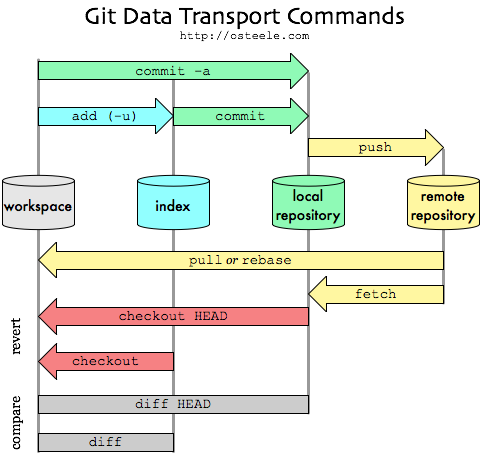

## 目录

#### Git
* [Git与GitHub](#a)
* [搭建环境](#b)
* [系统组成](#c)
* [常用操作](#d)
* [git/gitHub 的基本模型](#e)

## Git
#### 
一.Git与GitHub

1. 区别
    * Git: 版本控制工具
    * GitHub: 网站／远程仓库／社交平台
        * 远程仓库：
            * 免费：必须开源
            * 收费：可以闭源
2. 联系
    * 程序员电脑的git仓库向GitHub的仓库提交代码
#### 
二.搭建环境

1. 远程仓库
    * 公司自己建立私有仓库
    * 使用GitHub: https://github.com
2. 本地仓库
    * [msysgit(命令行)](./attachment/msysgit安装.doc)
    * [TortoiseGit(可视化)](./attachment/TortoiseGit.doc)
#### 
三.系统组成

1. 本地仓库
    * git
2. 远程仓库
    * gitHub
#### 
四.常用操作

1. 创建仓库
    * 创建远程仓库
        * 注册 github 账号
        * 在线创建仓库
    * 创建本地仓库
        * 克隆远程仓库到本地
        * 新生成本地仓库
2. 本地仓库和远程仓库相关联
    * ssh key
3. 提交本地仓库
    * git add *
    * git commit -m ' '
4. 查看状态
    * git status
5. 分支
    * git branch
    * git checkout -b feature_x
    * git checkout master
    * git branch -D feature_x
6. 合并
    * git diff
    * git merge
7. 冲突解决
    * 手动解决
8. 推送远程仓库
    * git push origin master
9. 同步远程仓库
    * git pull origin master
    * git fetch origin master
10. 查看 log 
    * git log
    * git reflog
11. 打标签
    * git tag 1.0.0
    * git tag
    * git checkout 1.0.0
12. 替换工作区中的内容
    * git reset --hard 
    * git checkout -- <fileName>
13. 忽略列表
    > .gitignore 配置文件用于配置不需要加入版本管理的文件，配置好该文件可以为我们的版本管理带来很大的便利
    * 添加忽略的配置文件.gitignore
    * 通过vim .gitignore来创建文件
    * 匹配规则:
        * 以斜杠 “ / ” 开头表示目录；
        * 以星号 “ * ” 通配多个字符；
        * 以问号 “ ? ” 通配单个字符
        * 以方括号 “ [ ] ” 包含单个字符的匹配列表；
        * 以叹号 “ ! ” 表示不忽略(跟踪)匹配到的文件或目录；
    * git 对于 .gitignore 配置文件是按行从上到下进行规则匹配的，意味着如果前面的规则匹配的范围更大，则后面的规则将不会生效
    * 示例：
    * 规则：
                
                fd1/*
        * 说明：忽略目录 fd1 下的全部内容；注意，不管是根目录下的 /fd1/ 目录，还是某个子目录 /child/fd1/ 目录，都会被忽略；
    
    * 规则：       
                
                /fd1/*
        * 说明：忽略根目录下的 /fd1/ 目录的全部内容；
    
    * 规则：
    
                /*
                !.gitignore
                !/fw/bin/
                !/fw/sf/
    
        * 说明：忽略全部内容，但是不忽略 .gitignore 文件、根目录下的 /fw/bin/ 和 /fw/sf/ 目录；
#### 

五.git与gitHub 的基本模型
1. 本地仓库  

    
    * 你的本地仓库由 git 维护的三棵“树”组成
        * 第1个: 工作区(working dir) 你的工作目录
        * 第2个: 暂存区（Index/Stage）它像个缓存区域，临时保存你的改动
        * 第3个: 版本区(HEAD), 它指向你最后一次提交的结果
2. 远程仓库
    
    